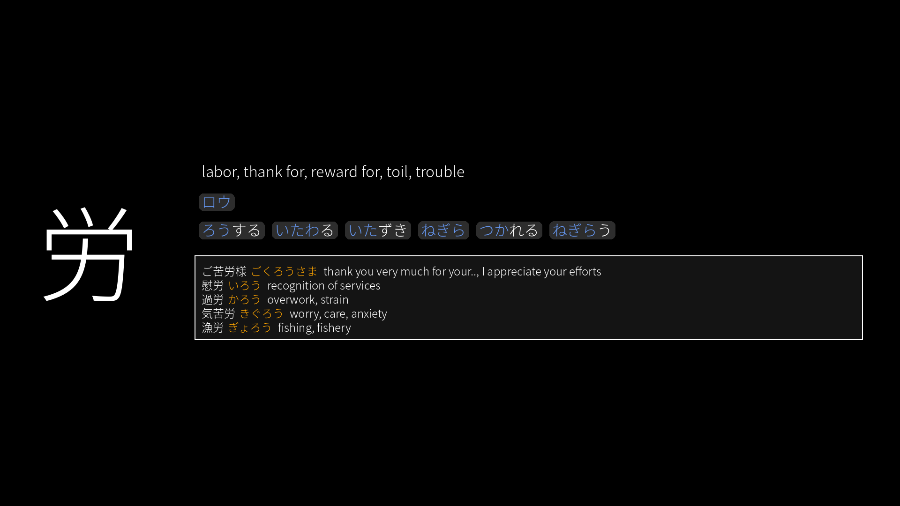

# Kanji Slideshow  
Automatic learning kanji through wallpaper slideshow. An example is below.  



# Required packages
This package requires the following Python packages:
- Pillow
- playwright

# Generate images  

```bash
python2 generate_kanji_images.py kanji_n2.csv # for N2
```

# Use as slideshow
Use shotwell to set wallpaper slideshow. Information is given below (In Indonesian language, right click translate to English)

To scale the image properly, use the following command:  

```bash
gsettings set org.gnome.desktop.background picture-options "scaled"
```
